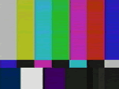
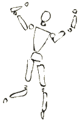

**[home](index.md) > [publications](publications.md) > interview 1998**

JHT interview 1998  
[1994](interview1994.md) [1995](interview1995.md) [1997](interview1997.md) 1998

interview with  
www.director-online.com

**DOUG: What is your background & what brought you to Macromedia?**

JT: I started programming back in high school using Basic. One of my teachers knew I was interested in computers and helped me get a job at a research facility in New York. There, I taught myself PL1, Fortran, Cobol, and something called JCL. I had a fascination with computer languages so I was determined to learn as many of them as possible and figure out how to build them.

I went to MIT & majored in Computer Science, with a minor in Visual Arts. I have always been interested in marrying visual things with computers, so I hung out at MIT's Media Lab... working on personal projects. This interest was reinforced by some work I was doing with a company called LCS. We worked on some video games, including the first dual-video disk game. We were also working on some graphic tools. The idea was to do something like MacPaint for DOS -- we called it TelePaint, and it was going to be part of a graphics suite called "TeleVision".

All along, I was working with the link between visuals and computers. I was doing some work with video and 3D special effects. That led to my move to the west coast to work for Droid Works, which was a division of LucasFilm. They were focused on creating the first non-linear editing system for film and video, called Edit Droid. I was hired to write the machine control between the editor's control pad and the stacks of laser disk machines that were part of the system. Each playback machine was linked in with a single board computer and the whole system was driven by a Sun workstation.

Ever since seeing Apple's "Lisa" computer, I had been interested in Apple computers. I really wanted to do some consulting work for Mac stuff. The husband of a friend at DroidWorks got me connected to Marc Canter and Macromind. I joined Macromind in 1987 as one of six engineers.

**DOUG: What were you hired to do at Macromind?**

JT: Marc hired me to write an accelerator to improve the playback performance of animation. Then I worked on the color paint program for Director (1).

**DOUG: You're often referred to as the "father of Lingo". Tell us about your original objectives for Lingo.**

JT: I had always been interested in languages, all the way back in high school. I wrote my first Basic interpreter in high school, and wrote two full blown Lisp intrepretor and compiler in college. So I had that background. At the same time, I was working on some personal projects where I wanted to have interactive control of video disks, but I wanted to control them with Director. So I wrote an xobject to do it and made that work and Lingo just grew from there.

Most of the interactive programs for the Mac were being done in HyperCard, using HyperTalk for scripting. I wanted to bring that interactivity to Director. Where the focus of Director had originally been visual stuff, in Director 2 we wanted to add the capability to do interactive simulations for sales and training. And maybe some simple games. Lingo at that time was very simple, like integer arithmetic, small stuff.

We were competing with HyperCard and HyperTalk, but Director was more free-format than the card-based authoring. A lot of Lingo was modeled after HyperTalk... handlers, events targeted to objects, and a scripting system geared toward non-programmers. Accessibility is very important... being able to let non-programmers get a lot of control.

**DOUG: How has Lingo evolved from your original concept, and where do you expect it to go?**

JT: With Director 3 and 3.1, Lingo was focused on parity with HyperTalk: chunk expressions, floating point, message hierarchy. But that's also when the player for Windows came out and there were a lot of problems with making Lingo work cross-platform. Lots of stuff to be re-written.

By the time we got to Director 4, I re-architected Lingo on a single codebase that would work cross-platform. Also, we changed it to a compiled language, so there was about a 10X performance improvement just by compiling the code.

We just kept expanding it... now there's all the netLingo.

**DOUG: I heard somewhere that a huge percentage of Director users never use any Lingo other than "go to...". Why do you think people are so afraid of "programming"?**

JT: No matter how easy you make it, there are still some concepts there that are not natural. You've got to be exposed to it in a logical, step-by-step way or it can be tough. That's what I wanted to do with my book. Make this accessible to non-programmers. Take them step-by-step through it... After go to, use random to add some variety to your animation. Then build up on top of that. Appreciate the new experiences...

**DOUG: What are you proudest of with Lingo?**

JT: Proudest of? That any variable can hold any value and Lingo can programmatically inspect and evaluate it. It's a fluid environment where you don't have to commit to a particular hierarchy to message objects. These key features make it easy to experiment. Also this gives Lingo alot of expressive power. You can see this most dramatically with our Director to Java converter. Simple Lingo scripts explode into many lines of Java, so you can see very directly why Director is easier to use and much more expressive than Java.

**DOUG: Tell us what it's like to see Director used for all the various applications. What's it like to see what people have done with the product? Is it surprising?**

JT: I am surprised how far people have stretched Lingo and Director, especially the movies that use 3D and Raycasting techniques. They make me scratch my head and think "how did they do that?"

When I go into the bookstores and see all the books or surf the web and see somebody's done something in Lingo it's inspiring. It makes me realized that there is alot of creative potential out there that was just waiting for the right tool. It inspires me to keep pushing Director forward so that more people can expressive themselves and use the computer creatively.

 [top](#topofpage)

**.........................................**

� 2001 John Henry Thompson - site by [Pixelyze](http://www.pixelyze.com/) & [CAGE](http://www.cage.nl/)

