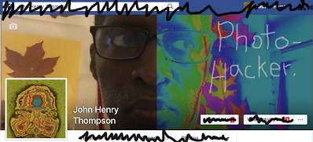
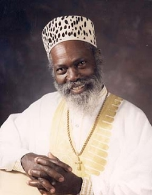

0\. Reflections - John Henry Thompson - Invent Your Future 

[John Henry Thompson - Invent Your Future](index.html)
------------------------------------------------------

    

### 0\. Reflections

[\[ DICE is here \]](3-dice.html)
=================================

Reflections on Learning
-----------------------

In his book “_The Children's Machine_” Seymour Papert observed there is a wealth of information on the art of teaching, but not much on **“the art of learning.”** He suggests one reason for the lack of focus on learning is a fear to express how we think and especially how we learn. Our minds may be not as neat an orderly as a textbook. Also, there is an unspoken fear of discussing what we don’t know. Papert suggestions: “talk freely about learning experiences,” to help dissipate the fear. His suggestion prompted me to reflect on my experience learning computer programming in the 1970's, a time when computers were not easy to come by.
=================================================================================================================================================================================================================================================================================================================================================================================================================================================================================================================================================================================================================================================================

Feelings about learning
-----------------------

The starting point for me in my learning adventure was emotional. I truly believed that education would provide me with the hope for a better future. I think I got this emotional imprint from [my father](heros/walter-thompson-bio.html). He grew up on a farm in Jamaica with little access to formal education. Although he had to leave school at age 12, he constantly reminded his five children of his love for education and how he was glad we had greater access to school than he had. His appreciation of educational opportunity and his constant praise of our accomplishments in school gave me **belief** and **hope** to focus on education. My father would say “with education you could accomplish anything you set your mind to”.

The other emotional component out side of school was my **passion** for drawing, math, solving puzzles and building electronic gadgets. I had a burning desire to figure out how electronic devices work. I built electron motors and radios from circuits described in library books. It was not enough to read about them, I only felt I understood something when I was able to built it and actually see it work.

My first "computer"
-------------------

I had not seen a real computer yet, but I had seen images of them on TV and in the movies. Computers in the popular media had a great mystic of power and intelligence. In 9th grade I took it on as a personal challenge to figure out how they worked. I tried to build a simple computing device use my basic knowledge of electronics. Using batteries, wires, and lights and I created a question/answer box. The box had a couple of questions with multiple choice answers labeled a, b, and c. To answer a question you’d slide in a card with the same label in the slot next to the question. If the answer was correct the correct light would light up.

Driven by my **passion** to understand computation, I set a **goal** to build a computer. My **plan** was to use all the knowledge I had readily available to me at that point: library books. My question/answer box would hardly qualify as a real computer. I set my next goal to learn how a real computer works. In the 1970’s computers were as large as several refrigerators and where only found in specialized computer centers. I only saw them on TV and none in real life yet. I believed my fathers words: “with education you could accomplish anything you set your mind to.” I simply needed to find a computer.

My support network
------------------

In 1974, for 10th grade I enter Bronx High School of Science. I shared by desire to learn more about computers with my geometry teacher, Ms. Strauss, and she directed me to the math department’s computer lab. Normally only 11th grade students could enter have computer lab. Fortunately, in the 9th grade I already completed both 9th grade math and 11th grade math, thanks to an innovative program designed by Mr. Cutler, a math teacher at Junior High School 80 in the Bronx NY. I spoke with the department head and convinced her to let me in early. I gave up lunch period to squeeze in the extra period of computer lab. I was so excited to finally learn computer programming I even came to school early to get extra time in the lab.

Ms. Strauss did another big favor for me. In the computer lab I found two students who where actually already working after school in computer centers. I was amazed. You could get a paying job as a high school student working with computers! With all the extra time I was putting into the computer lab I was confident that I too could work in a computer center. I asked Ms. Strauss for help, and she referred me to a special program called The Youth Opportunity Program which was run by New York State. The program was designed to provide low-income high school students employment in a professional environment, with the vision it would help them develop a career. In this program, I got a position as computer operator in the New York State Psychiatric Institute, only two train stops from my home in Harlem. On the computer center floor was a lab for sleep research and another lab with live-in patients, subjects of a long-term drug studies. Here they did mental health research on both lab animals and human patients. A very interesting place.

I worked in the computer center every day after school from four until eight o'clock. Between feeding punch cards into the large mainframe computer and folding printouts I'd do my homework and taught myself other computer languages. My personal goal was to learn every language available in the center and sell my computer skills to the clients of the computer center. I learned the other languages by reading the manuals and challenging my self to write a complete program in each.

I was fortunate to have a strong **support network** that helped me fulfill my desire to learn the mysteries the computer. By working in a real research facility I experienced direct, tangible applications of the knowledge I acquired in the classroom. My parents gave me the **belief** in fulfilling my dreams and the **hope** of education. Once I expressed by **goal**, by school, my teachers, and special social programs help me implement my **plan.** I took personal charge of my learning by working directly on projects that built on my personal **passion**. 

Learning computers today

Today if you have a passion to learn about computer, you will not have to face some of the challenges I faced. Affordable computers are in schools, libraries and most homes. As computers have grown more powerful and more popular, computer programming has also evolved. There are a many options for learning computer programming and there are project specially designed to make it easy to learn programming. One example is [Scratch developed by the Life Long Kindergarten group at the MIT Media Lab, (http://scratch.mit.edu/).](http://scratch.mit.edu/) Using Scratch even very young children can to learn programming in a playful, visual environment. 

One of my passions now is to help contribute to the **support network** for learners by sharing my stories, and helping others learn programming in new and exciting ways. I wish you good fortune in your learning adventure.

[Visit my Learn to code page to see my latest learn to code workshops and online classes.](learning-to-program.html)

(c) 2005-2017 John Henry Thompson. All rights reserved.

[Click here for photohacker workshop.](https://github.com/jht1900/photohacker)

  

[Click here to join my computer science class at codehs.com](http://codehs.com/go/7444)

  

[Colorized photo portrait created in the 1980's at MIT Media Lab.](http://www.j4u2.com/jht/art1982.html)

  

[Proud member of my 1977 high school computer club.](http://bxscience.edu/index.jsp)

  

Ms. J. Strauss, my 10th grade math teacher. Got me my first computer job.

  

Mr. Cutler, my 9th grade math teacher. Gave me a boost in math by teaching two years of math in one.

  

[Walter Thompson. Give me love for education.](heros/walter-thompson-bio.html)

  

