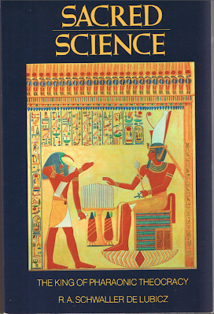

Thoth - John Henry Thompson

[5\. Respect](../../heros.html)‎ > ‎[Professor John Fray](../professor-john-fray.html)‎ > ‎

### Thoth

[From Phaedrus](http://classics.mit.edu/Plato/phaedrus.html)

Socrates:

At the Egyptian city of Naucratis, there was a famous old god, whose name was Theuth; the bird which is called the Ibis is sacred to him, and he was the inventor of many arts, such as arithmetic and calculation and geometry and astronomy and draughts and dice, but his great discovery was the use of letters.

Now in those days the god Thamus was the king of the whole country of Egypt; and he dwelt in that great city of Upper Egypt which the Hellenes call Egyptian Thebes, and the god himself is called by them Ammon. To him came Theuth and showed his inventions, desiring that the other Egyptians might be allowed to have the benefit of them; he enumerated them, and Thamus enquired about their several uses, and praised some of them and censured others, as he approved or disapproved of them.

It would take a long time to repeat all that Thamus said to Theuth in praise or blame of the various arts. But when they came to letters, This, said Theuth, will make the Egyptians wiser and give them better memories; it is a specific both for the memory and for the wit. Thamus replied: O most ingenious Theuth, the parent or inventor of an art is not always the best judge of the utility or inutility of his own inventions to the users of them.

And in this instance, you who are the father of letters, from a paternal love of your own children have been led to attribute to them a quality which they cannot have; for this discovery of yours will create forgetfulness in the learners' souls, because they will not use their memories; they will trust to the external written characters and not remember of themselves.

The specific which you have discovered is an aid not to memory, but to reminiscence, and you give your disciples not truth, but only the semblance of truth; they will be hearers of many things and will have learned nothing; they will appear to be omniscient and will generally know nothing; they will be tiresome company, having the show of wisdom without the reality.

[Technopoly: The Surrender of Culture to Technology](https://www.amazon.com/Technopoly-Surrender-Technology-Neil-Postman/dp/0679745408)

> Neil Postman is one of the most level-headed analysts of education, media, and technology, and in this book he spells out the increasing dependence upon technology, numerical quantification, and misappropriation of "Scientism" to all human affairs. No simple technophobe, Postman argues insightfully and writes with a stylistic flair, profound sense of humor, and love of language increasingly rare in our hastily scribbled e-mail-saturated world.

[Cover image from Sacred Science Book.](http://www.amazon.com/Sacred-Science-King-Pharaonic-Theocracy/dp/0892812222)  
Shows [Theuth](http://en.wikipedia.org/wiki/Thoth) (Dḥwty) presenting his inventions to Thamus, the king of Egypt.
