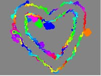

03 Session - John Henry Thompson - Invent Your Future 

[John Henry Thompson - Invent Your Future](../../index.html)
------------------------------------------------------------

../../system/app/pages/sitemap/hierarchy.html)
    

[2\. The Art of Learning](../../the-art-of-learning.html)‎ > ‎[Learning Creative Learning](../learning-creative-learning.html)‎ > ‎

### 03 Session

//<!\[CDATA\[ function JOT\_insertRelDate(timestamp, absTimeStr, isSiteLocale, dir) { var relTimeStr = JOT\_formatRelativeToNow(timestamp, isSiteLocale); if (relTimeStr) { if (isSiteLocale) { document.write('' + relTimeStr + '<' + '/span>'); } else { document.write('' + relTimeStr + '<' + '/span>'); } } else { document.write(absTimeStr); } } //\]\]> posted Feb 21, 2013, 1:14 PM by John Henry Thompson   \[ updated May 4, 2013, 8:44 AM \]

Readings in Preparation for Session 3 (Feb 25): Constructionism and Making

\* Seymour Papert (1980): Mindstorms[(Chapter 1: Computers and Computer Cultures)](http://llk.media.mit.edu/courses/readings/mindstorms-chap1.pdf)

\* Seymour Papert (1994): The Children’s Machine[(Chapter 7: Instructionism versus Constructionism)](http://llk.media.mit.edu/courses/readings/childrens-machine.pdf)

\* Dale Dougherty: [The Maker Mindset](http://llk.media.mit.edu/courses/readings/maker-mindset.pdf) and [Learning by Making](http://www.slate.com/articles/technology/future_tense/2012/06/maker_faire_and_science_education_american_kids_should_be_building_rockets_and_robots_not_taking_standardized_tests_.html%0A)

\* Dale Dougherty (2011): [The Heart of Maker Faire](http://makerfaire.com/makerfairehistory/) (video)

\* Leah Buechley (2012):[NSF Cyberlearning Summit Talk on Art, Craft, and Electronics](http://llk.media.mit.edu/courses/video.php?provider=youtube&vid=Y6XRYqbQMzA) (video)

\* Mitchel Resnick et al. (2009):[Scratch: Programming for All](http://www.media.mit.edu/~mres/papers/Scratch-CACM-final.pdf). Communications of the ACM.

In preparation, please read the suggested readings (above) and discuss with your group:

\* What ideas in the readings interested or resonated with you?

\* How could you apply these ideas to help others learn in your own work, family, or community?

Activity

For this week's activity, create an Scratch project about things you like to do, then share it using the links below. If you are new to Scratch, first follow the 4 steps listed under New to Scratch?

Things I Like To Do Activity

1) Create a Scratch project about things you like to do.

2) Share your project on the [Scratch website](http://scratch.mit.edu/).

3) Add the project to the [LCL: What We Like To Do gallery](http://scratch.mit.edu/galleries/view/192539)

4) Share your thoughts about your experience and challenges in making your project with your group

New to Scratch?

1) For an overview, watch the[Scratch Intro Video](http://scratch.mit.edu/static-locale/html/video_us.html) on the[Scratch home page](http://scratch.mit.edu/).

2) Follow the steps for[Getting Started with Scratch](http://info.scratch.mit.edu/Support/Get_Started). You can access helpful resources on the[Support](http://scratch.mit.edu/support) page, including Scratch in multiple[languages](http://info.scratch.mit.edu/Languages).

3)[Download](http://infoscratch.media.mit.edu/Scratch_1.4_Download) and install the Scratch software.

4)[Sign up](http://scratch.mit.edu/signup) for a Scratch account so you can share and download projects.

Additional Resources

\* Leah Buechley, [High-Low Tech](http://hlt.media.mit.edu/), research group website

\* The [Maker Education Initiative website](http://makered.org/)

\* Mitchel Resnick (2012).[Let’s Teach Kids to Code](http://on.ted.com/MResnick) (TED Talk video).

\* Seymour Papert (1980). Mindstorms ([Introduction: Computers for Children](http://llk.media.mit.edu/courses/readings/Mindstorms_Intro.pdf),[Chapter 2: Mathophobia: The Fear of Learning](http://llk.media.mit.edu/courses/readings/mindstorms-chap2.pdf),[Chapter 3: Turtle Geometry: A Mathematics Made for Learning](http://llk.media.mit.edu/courses/readings/mindstorms-chap3.pdf)).

  

[http://makered.org](http://makered.org/)

  

[scratch gallery](http://scratch.mit.edu/galleries/view/192539)

[  
my scratch projects](http://scratch.mit.edu/users/jht1900)

  

  

  

Leah Buechley's video: Great way to combine a  bunch of things: art, direct manipulation, visualization: reminded me of the Question-Answer book I build for a science project in 9th grade.

Comments

[Sign in](https://accounts.google.com/ServiceLogin?continue=http://sites.google.com/a/johnhenrythompson.com/jht/the-art-of-learning/learning-creative-learning/3rdsession&service=jotspot)|[Recent Site Activity](../../system/app/pages/recentChanges.html)|[Report Abuse](http://sites.google.com/a/johnhenrythompson.com/jht/system/app/pages/reportAbuse)|[Print Page](javascript:;)|Powered By **[Google Sites](http://sites.google.com/site)**

window.jstiming.load.tick('sjl'); JOT\_postEvent('moduleLoad'); window.jstiming.load.tick('jl'); sites.Searchbox.initialize( 'sites-searchbox-search-button', {"object":\[\]}\['object'\], 'search-site', {"label":"Configure search options...","url":"/system/app/pages/admin/settings"}); gsites.HoverPopupMenu.createSiteDropdownMenus('sites-header-nav-dropdown', false); JOT\_setupNav("2bd", "Navigation", true); JOT\_addListener('titleChange', 'JOT\_NAVIGATION\_titleChange', 'COMP\_2bd'); new sites.CommentPane('//docs.google.com/comments/d/AAHRpnXtRMj1XgBLQa4Y22KDIypZzMBseQwT3ox3jtLpaJLSiQGSGfX-pg43Pz73XBMvhi8nGV7cNL1X2dGVMOIrFvRT\_j61z-HUxOh3vfBV389HMPXAqWU1ckNo\_mSxiQA0qYBxblWYS/api/js?anon=true', false, false); setTimeout(function() { var fingerprint = gsites.date.TimeZone.getFingerprint(\[1109635200000, 1128902400000, 1130657000000, 1143333000000, 1143806400000, 1145000000000, 1146380000000, 1152489600000, 1159800000000, 1159500000000, 1162095000000, 1162075000000, 1162105500000\]); gsites.Xhr.send('http://www.johnhenrythompson.com/\_/tz', null, null, 'GET', null, null, { afjstz: fingerprint }); }, 500); window.onload = function() { if (false) { JOT\_setMobilePreview(); } var loadTimer = window.jstiming.load; loadTimer.tick("ol"); loadTimer\["name"\] = "load," + webspace.page.type + ",user\_page"; window.jstiming.report(loadTimer, {}, 'http://csi.gstatic.com/csi'); } JOT\_insertAnalyticsCode(false, false); var maestroRunner = new gsites.pages.view.SitesMaestroRunner( webspace, "en"); maestroRunner.initListeners(); maestroRunner.installEditRender(); //<!\[CDATA\[ // Decorate any fastUI buttons on the page with a class of 'goog-button'. if (webspace.user.hasWriteAccess) { JOT\_decorateButtons(); } // Fires delayed events. (function() { JOT\_fullyLoaded = true; var delayedEvents = JOT\_delayedEvents; for (var x = 0; x < delayedEvents.length; x++) { var event = delayedEvents\[x\]; JOT\_postEvent(event.eventName, event.eventSrc, event.payload); } JOT\_delayedEvents = null; JOT\_postEvent('pageLoaded'); })(); //\]\]> JOT\_postEvent('decorateGvizCharts'); JOT\_setupPostRenderingManager(); JOT\_postEvent('renderPlus', null, 'sites-chrome-main'); sites.codeembed.init();

window.jstiming.load.tick('render'); JOT\_postEvent('usercontentrendered', this);