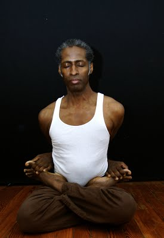

Patanjali's Yoga Sutras - A Comparison

[Yoga](../yoga.html)‎ > ‎

### Patanjali's Yoga Sutras - A Comparison

After taking yoga classes for a while someone asked me what is "Raja Yoga." I wasn't sure but I thought it had something to do with royalty or nobility - like the four noble truths of Buddhism. I wasn't happy with the vagueness of my answer and decided to research.

Raja Yoga is defined in the ancient text Patanjani's Yoga Sutras. Written circa 5,000 B.C. - 300 A.D, the Sutras are organized into four books:

[Book 1](patanjani/book-1.html) [Book 2](patanjani/book-2.html) [Book 3](patanjani/book-3.html) [Book 4](patanjani/book-4.html)

The Yoga Sutras have been translated and commented on by many authors over many centuries. Here I compare a few of these translations.

[Click to read the first sutra](patanjani/book-1/11.html)

---

James H. Woods, a Havard professor of philosophy in the early 1900's gives a very detailed translation of Patanjani's Yoga Sutras along with early commentary and explanations by other authors. His entire work is available online, thanks to google digital book. Thank you google for providing such flexible online access to public domain content.

[Title page from James H. Wood's translation (long titles popular back then I guess):](http://books.google.com/books?id=YzFImjtOxUwC&pg=PR3&ci=20%2C54%2C931%2C809&source=bookclip)

THE  
YOGA SYSTEM OF PATANJALI  
Or the Ancient Hindu Doctrine of Concentration of Mind  
EMBRACING  
THE MNEMONIC RULES, CALLED YOGA SUTRAS, OF PATANJALI  
AND  
THE COMMENT, CALLED YOGA-BHASHYA ATTRIBUTED TO VEDA-VYASA  
AND  
THE EXPLANATION CALLED TATTVA VAICARADl OF VACHASPATI-MICBA  
TRANSLATED FROM THE ORIGINAL SANSKRIT  
BY  
JAMES HAUGHTON WOODS  
PROFESSOR OF PHILOSOPHY IN HARVARD UNIVERSITY

---

References to translations and interpretation of the Yoga Sutras:

[\[RS\] Website ashtangayoga.info by Arjuna, Dr. Ronald Steiner](http://www.ashtangayoga.info/philosophy/yoga-sutra-patanjali/)

[\[JW\] The Yoga-System of Patanjali, By Patañjali, Vyāsa, Vācaspatimiśra. Translated by James H. Woods](http://books.google.com/books?id=YzFImjtOxUwC)

[\[SS\] The Yoga Sutras of Patanjali: Commentary on the Raja Yoga Sutras by Sri Swami Satchidananda](http://www.amazon.com/Yoga-Sutras-Patanjali-Commentary-Satchidananda/dp/0932040381)

[\[TD\] The Heart of Yoga: Developing a Personal Practice by T. K. V. Desikachar](http://www.amazon.com/Heart-Yoga-Developing-Personal-Practice/dp/089281764X/ref=sr_1_5?ie=UTF8&qid=1326228195&sr=8-5)

[\[EB\] The Yoga Sutras of Patañjali: A New Edition, Translation, and Commentary by Edwin Francis Bryant](http://www.amazon.com/Yoga-Sutras-Patanjali-Translation-Commentary/dp/0865477361/ref=sr_1_1?ie=UTF8&s=books&qid=1250508322&sr=1-1)

---

---

My motivation for this study is related to what Patanjani writes in Book 1 sentence 39. He gives suggestions to eliminate our misconceptions, including:

**यथाभिमतध्यानाद्वा ॥३९॥**  
yathā-abhimata-dhyānād-vā ||39||

(**यथ**, yatha) = how  
(**आभिमत**, ābhimata) = love  
(**ध्यानाद्**, dhyānād) = meditation  
(**वा**, vā) = or

[\[RS\] 1.39 Or through contemplation (dhyana) of love.](http://www.ashtangayoga.info/philosophy/yoga-sutra-patanjali/chapter-1/item/yatha-abhimata-dhyanad-va-39)

[\[JW\] 1.39 Or \[the mind stuff reaches the stable state\] by contemplation upon any such an object as is desired.](http://books.google.com/books?id=YzFImjtOxUwC&pg=PA77&ci=150%2C314%2C699%2C54&source=bookclip) [\[Image\]](http://www.johnhenrythompson.com/yoga/patanjani/Book1-39.png?attredirects=0)

[\[SS\]](http://www.amazon.com/Yoga-Sutras-Patanjali-Commentary-Satchidananda/dp/0932040381) 1.39 Or by meditating on anything one chooses that is elevating. \[p62\]

[\[TD\]](http://www.amazon.com/Heart-Yoga-Developing-Personal-Practice/dp/089281764X/ref=sr_1_5?ie=UTF8&qid=1326228195&sr=8-5) 1.39 Any inquiry of interest can calm the mind. \[p161\]

[\[EB\]](http://www.amazon.com/Yoga-Sutras-Patanjali-Translation-Commentary/dp/0865477361/ref=sr_1_1?ie=UTF8&s=books&qid=1250508322&sr=1-1) 1.39 Or \[steadiness of mind is attained\] from meditation upon anything of one's inclination. \[p139\]

Subpages (4): [Book 1](patanjani/book-1.html) [Book 2](patanjani/book-2.html) [Book 3](patanjani/book-3.html) [Book 4](patanjani/book-4.html)
